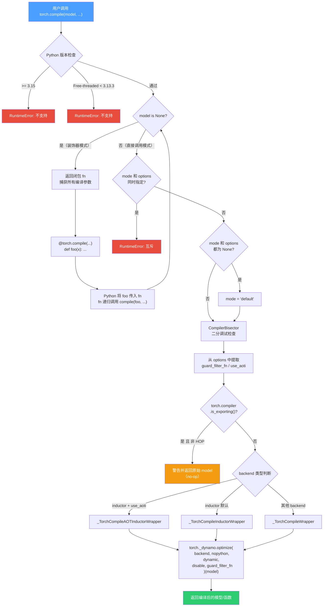
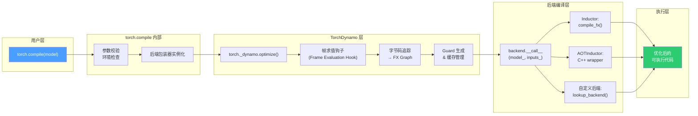
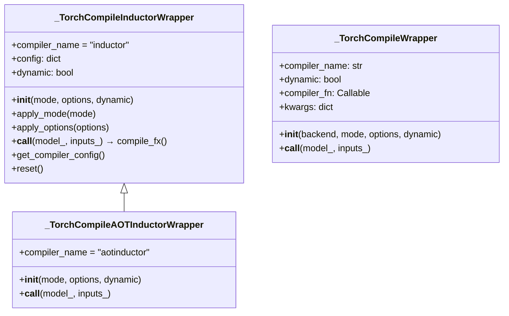
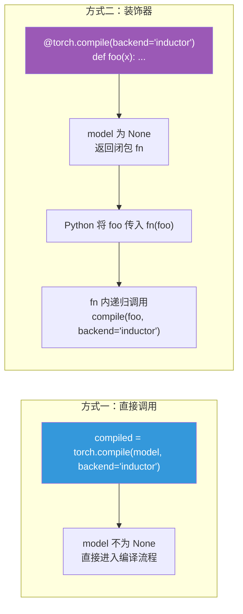
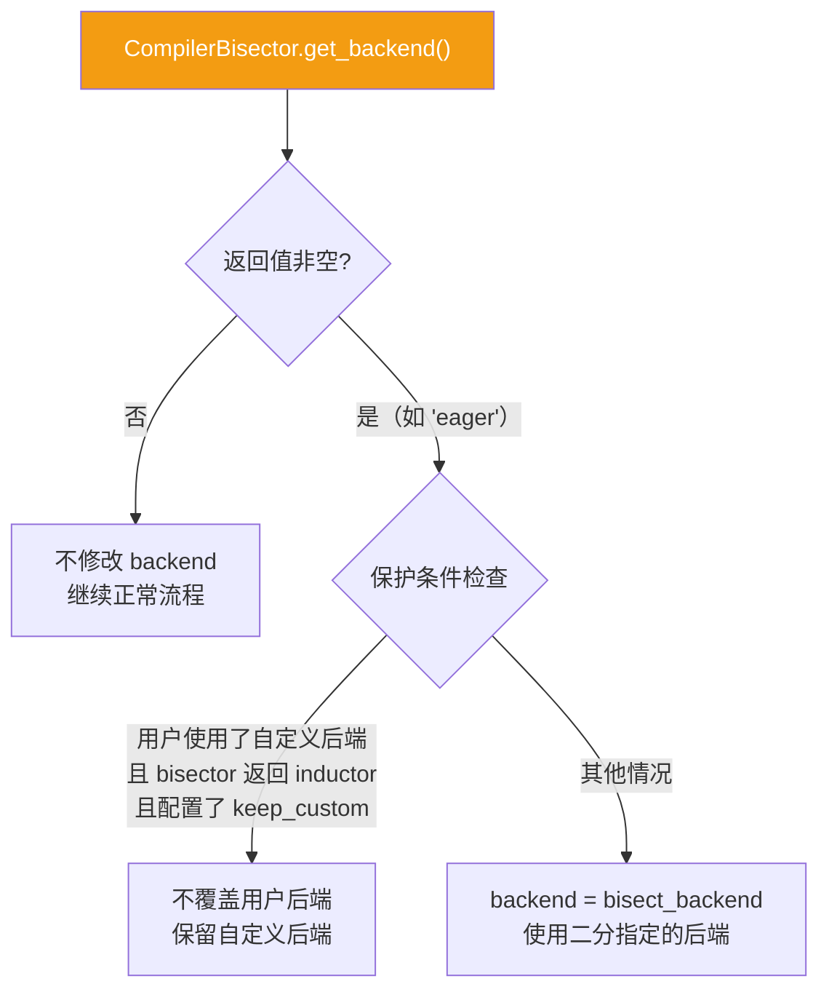
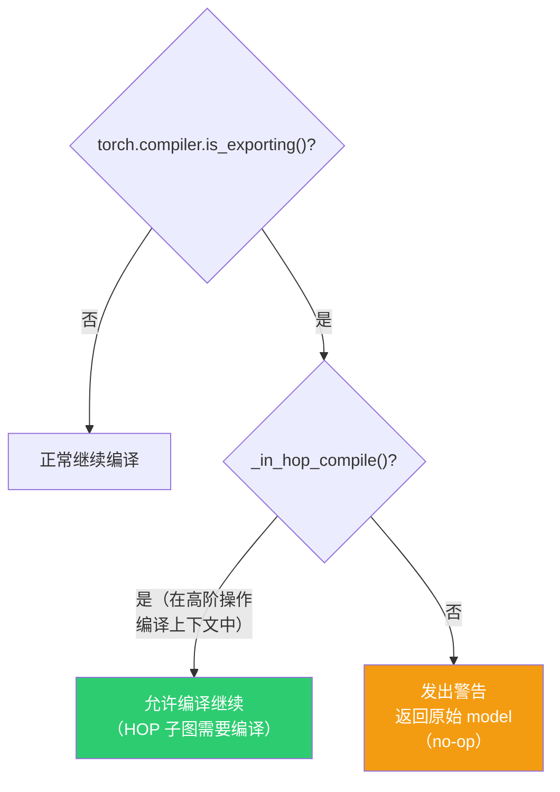
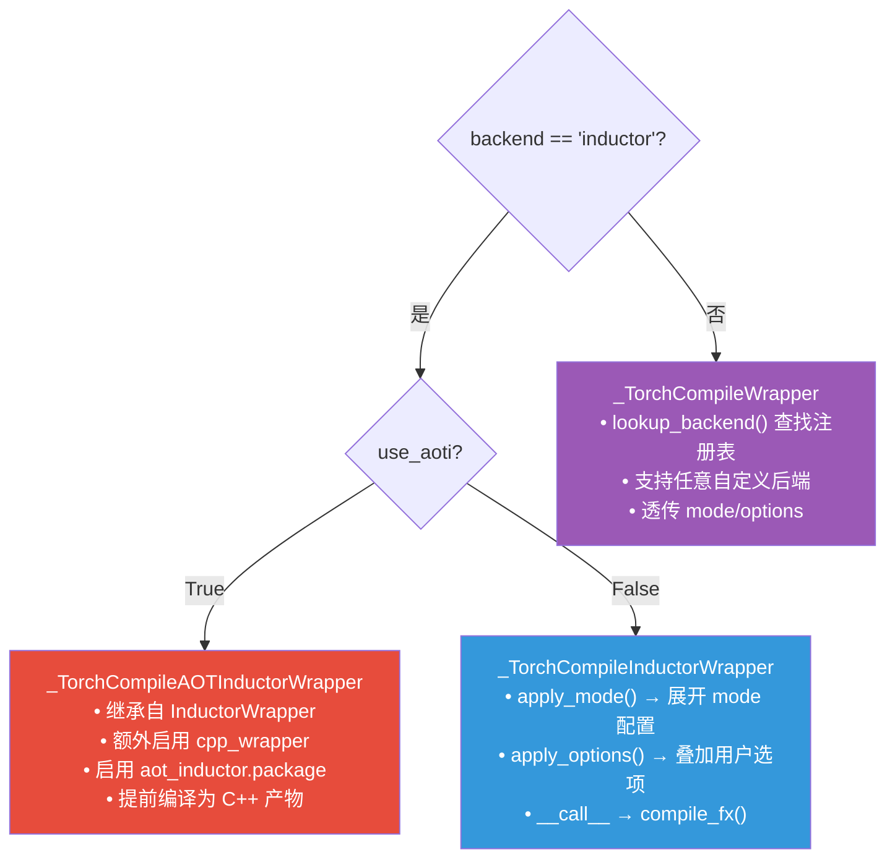
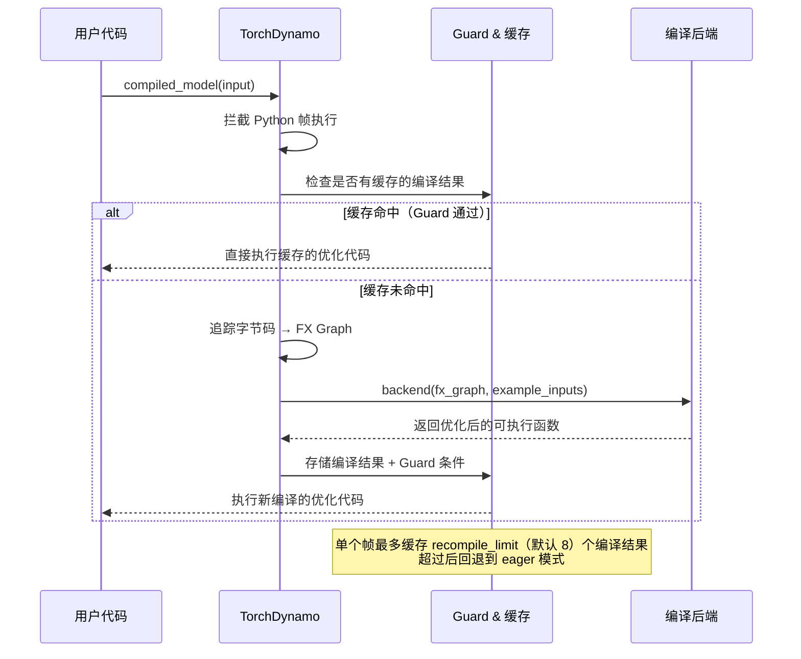

# torch.compile 源码深度解析

> 基于 PyTorch 主干分支 `torch/__init__.py` 中 `torch.compile` 函数的完整源码分析。

---

## 目录

- [1. 概述](#1-概述)
- [2. 整体调用栈](#2-整体调用栈)
- [3. 函数签名与参数详解](#3-函数签名与参数详解)
- [4. 逐段源码解析](#4-逐段源码解析)
  - [4.1 Python 版本兼容性检查](#41-python-版本兼容性检查)
  - [4.2 装饰器模式处理](#42-装饰器模式处理)
  - [4.3 mode 与 options 互斥校验](#43-mode-与-options-互斥校验)
  - [4.4 CompilerBisector 二分调试](#44-compilerbisector-二分调试)
  - [4.5 特殊选项提取](#45-特殊选项提取)
  - [4.6 torch.export 兼容性](#46-torchexport-兼容性)
  - [4.7 后端实例化](#47-后端实例化)
  - [4.8 最终编译调用](#48-最终编译调用)
- [5. 后端包装器架构](#5-后端包装器架构)
- [6. 编译模式（mode）对照表](#6-编译模式mode对照表)
- [7. 能力范围与限制](#7-能力范围与限制)
- [8. 使用示例](#8-使用示例)

---

## 1. 概述

`torch.compile` 是 PyTorch 2.x 引入的核心编译入口，利用 **TorchDynamo**（字节码级别的 Python 追踪器）捕获用户模型/函数的计算图（FX Graph），然后交给指定的**后端**（默认 Inductor）进行优化编译。

其核心职责：
1. **参数校验与环境检查** — 确保运行环境兼容
2. **支持两种调用模式** — 直接调用与装饰器
3. **后端分发** — 根据配置选择并实例化正确的编译后端
4. **委托给 TorchDynamo** — 最终调用 `torch._dynamo.optimize()` 完成真正的编译流程

---

## 2. 整体调用栈

### 2.1 torch.compile 主流程



### 2.2 从 torch.compile 到实际执行的完整链路



### 2.3 后端包装器类层次结构



---

## 3. 函数签名与参数详解

```python
def compile(
    model: Callable | None = None,
    *,
    fullgraph: bool = False,
    dynamic: bool | None = None,
    backend: str | Callable = "inductor",
    mode: str | None = None,
    options: dict | None = None,
    disable: bool = False,
) -> Callable:
```

### 参数说明

| 参数 | 类型 | 默认值 | 说明 |
|------|------|--------|------|
| `model` | `Callable \| None` | `None` | 待编译的模型或函数。为 `None` 时启用装饰器模式 |
| `fullgraph` | `bool` | `False` | 是否要求整个函数捕获为单个完整图。`True` 时遇到 graph break 会抛出异常 |
| `dynamic` | `bool \| None` | `None` | 动态形状控制：`True`=生成动态 kernel，`False`=始终特化，`None`=自动检测 |
| `backend` | `str \| Callable` | `"inductor"` | 编译后端名称或自定义后端函数 |
| `mode` | `str \| None` | `None` | 预置优化策略：`"default"` / `"reduce-overhead"` / `"max-autotune"` / `"max-autotune-no-cudagraphs"` |
| `options` | `dict \| None` | `None` | 细粒度后端配置字典（与 `mode` 互斥） |
| `disable` | `bool` | `False` | 设为 `True` 时 compile 变为空操作，便于调试 |

> **注意**：`*` 之后的所有参数必须以**关键字方式**传递，防止位置参数误用。

### 返回值

- **装饰器模式**（`model is None`）：返回 `Callable[[Callable], Callable]`，即装饰器函数
- **直接调用模式**：返回 `Callable`，即编译后的模型/函数

---

## 4. 逐段源码解析

### 4.1 Python 版本兼容性检查

```python
import sysconfig

_C._log_api_usage_once("torch.compile")
if sys.version_info >= (3, 15):
    raise RuntimeError("torch.compile is not supported on Python 3.15+")
elif sysconfig.get_config_var("Py_GIL_DISABLED") == 1 and sys.version_info < (3, 13, 3):
    raise RuntimeError(
        "torch.compile is not supported on Python < 3.13.3 built with GIL disabled. "
        "Please use Python 3.13.3+."
    )
```

**功能分解：**

| 行 | 功能 |
|----|------|
| `import sysconfig` | 导入 Python 构建配置模块 |
| `_C._log_api_usage_once(...)` | 通过 C++ 扩展记录 API 使用（遥测统计），仅记录一次 |
| `sys.version_info >= (3, 15)` | 禁止 Python 3.15+，因为 TorchDynamo 深度依赖 CPython 帧求值机制，3.15 尚未适配 |
| `Py_GIL_DISABLED == 1` | 检测 Free-threaded Python（无 GIL 构建），3.13.3 之前的无 GIL 版本与 Dynamo 的帧评估钩子不兼容 |

### 4.2 装饰器模式处理

```python
# Decorator mode
if model is None:

    def fn(model: _Callable[_InputT, _RetT]) -> _Callable[_InputT, _RetT]:
        if model is None:
            raise RuntimeError("Model can't be None")
        return compile(
            model,
            fullgraph=fullgraph,
            dynamic=dynamic,
            backend=backend,
            mode=mode,
            options=options,
            disable=disable,
        )

    return fn
```

**设计要点：**

这段代码实现了 `torch.compile` 的**双模式调用**：



- 当作为 `@torch.compile(...)` 装饰器使用时，`model` 为 `None`
- 函数返回闭包 `fn`，该闭包通过**词法作用域**捕获了所有编译参数
- Python 将被装饰的函数传入 `fn`，闭包**递归调用** `compile`，此时 `model` 不再为 `None`，进入正常编译流程
- 闭包内的 `if model is None` 是防御性检查——防止 `@torch.compile()` 后又传入 `None`

### 4.3 mode 与 options 互斥校验

```python
if mode is not None and options is not None:
    raise RuntimeError(
        "Either mode or options can be specified, but both can't be specified at the same time."
    )
if mode is None and options is None:
    mode = "default"
```

**设计逻辑：**

- `mode` 是预置的优化策略组合，内部会展开为一组 `options`
- `options` 是用户手动指定的细粒度配置
- 两者同时指定会产生语义冲突，因此**互斥**
- 两者都未指定时，默认使用 `"default"` 模式

### 4.4 CompilerBisector 二分调试

```python
from torch._inductor.compiler_bisector import CompilerBisector

if bisect_backend := CompilerBisector.get_backend():
    import torch._inductor.config as inductor_config

    if not (
        inductor_config.test_configs.bisect_keep_custom_backend_for_inductor
        and bisect_backend == "inductor"
        and not isinstance(backend, str)
    ):
        backend = bisect_backend
```

**功能说明：**

`CompilerBisector` 是 PyTorch 的**编译器二分定位工具**，用于在编译产出代码出现正确性问题时，通过二分法在 "编译执行" 和 "eager 执行" 之间切换不同子图，定位出问题子图。



- 使用了 Python 3.8+ 的**海象运算符** `:=`
- 特殊保护：避免在二分调试时破坏第三方框架（如 vLLM）的自定义后端集成

### 4.5 特殊选项提取

```python
guard_filter_fn = None
use_aoti = False
if options and isinstance(options, dict):
    guard_filter_fn = options.pop("guard_filter_fn", None)
    use_aoti = options.pop("use_aoti", False)
```

**功能说明：**

从 `options` 字典中 **`pop`（提取并移除）** 两个不属于后端配置的特殊键：

| 键 | 类型 | 作用 |
|----|------|------|
| `guard_filter_fn` | `Callable \| None` | 自定义 TorchDynamo Guard 的过滤逻辑，控制哪些守卫条件被保存。不稳定的高级特性 |
| `use_aoti` | `bool` | 是否使用 AOTInductor（Ahead-of-Time Inductor），将模型编译为独立的 C++ 包装器用于部署 |

使用 `pop` 而非 `get` 确保这两个键**不会被传递到下游后端**，避免未知选项报错。

### 4.6 torch.export 兼容性

```python
if torch.compiler.is_exporting():
    from torch._higher_order_ops.utils import _in_hop_compile

    if not _in_hop_compile():
        warnings.warn(
            "torch.compile is ignored when called inside torch.export region",
            stacklevel=2,
        )
        return model
```

**逻辑解析：**



- `torch.export` 用于将模型导出为可序列化的中间表示（IR），此过程中 `torch.compile` 没有实际意义
- **例外**：高阶操作（如 `torch.cond`、`torch.map`）内部可能需要编译子图，此时 `torch.compile` 仍然生效

### 4.7 后端实例化

```python
if backend == "inductor":
    if use_aoti:
        backend = _TorchCompileAOTInductorWrapper(mode, options, dynamic)
    else:
        backend = _TorchCompileInductorWrapper(mode, options, dynamic)
else:
    backend = _TorchCompileWrapper(backend, mode, options, dynamic)
```

**后端分发逻辑：**



**`_TorchCompileInductorWrapper` 初始化流程：**

1. `apply_mode(mode)` → 调用 `torch._inductor.list_mode_options(mode)` 获取该 mode 对应的全部 inductor 配置项
2. `apply_options(options)` → 叠加用户自定义选项，带类型校验
3. `apply_options(CompilerBisector.get_config_change("inductor"))` → 叠加二分调试的配置更改
4. 检查 CUDA 版本：若启用 `triton.cudagraphs` 且 CUDA < 12.6，设置环境变量禁用 CUPTI 懒重初始化（绕过已知崩溃问题）
5. `__call__` 最终调用 `torch._inductor.compile_fx.compile_fx(model_, inputs_, config_patches=self.config)`

### 4.8 最终编译调用

```python
return torch._dynamo.optimize(
    backend=backend,
    nopython=fullgraph,
    dynamic=dynamic,
    disable=disable,
    guard_filter_fn=guard_filter_fn,
)(model)
```

**这是整个函数的终点**。参数映射关系：

| `torch.compile` 参数 | `torch._dynamo.optimize` 参数 | 含义 |
|----------------------|-------------------------------|------|
| `backend`（已实例化的包装器） | `backend` | 图编译后端 |
| `fullgraph` | `nopython` | 禁止 graph break（nopython = 无 Python fallback） |
| `dynamic` | `dynamic` | 动态形状 |
| `disable` | `disable` | 禁用编译 |
| `guard_filter_fn` | `guard_filter_fn` | Guard 过滤器 |

`torch._dynamo.optimize()` 返回 `OptimizeContext`（装饰器/上下文管理器），立即以 `(model)` 调用，在模型的 Python 帧求值层安装钩子。

**运行时行为：**



---

## 5. 后端包装器架构

### _TorchCompileInductorWrapper

标准 Inductor 后端的包装器，负责将 `mode` 和 `options` 转换为 inductor config：

| 方法 | 功能 |
|------|------|
| `apply_mode(mode)` | 将 mode 字符串展开为 inductor 配置项字典 |
| `apply_options(options)` | 逐项校验类型并合并到 `self.config` |
| `__call__(model_, inputs_)` | 调用 `compile_fx(model_, inputs_, config_patches=self.config)` |
| `get_compiler_config()` | 获取合并后的完整配置快照 |
| `reset()` | 若启用了 CUDA Graphs，重置 cudagraph trees |

### _TorchCompileAOTInductorWrapper

继承自 `_TorchCompileInductorWrapper`，额外：
- 启用 `cpp_wrapper=True`（生成 C++ 包装器）
- 启用 `aot_inductor.package=True`（打包为可部署产物）
- `__call__` 中设置 `V.set_aot_compilation(True)` 上下文

### _TorchCompileWrapper

通用包装器，用于非 Inductor 的任何后端：
- 通过 `torch._dynamo.backends.registry.lookup_backend(backend)` 查找已注册的后端
- 透传 `mode` 和 `options` 作为 kwargs

---

## 6. 编译模式（mode）对照表

| Mode | CUDA Graphs | Triton 自动调优 | 适用场景 |
|------|-------------|----------------|----------|
| `"default"` | 不启用 | 不启用 | 通用场景，性能与编译开销的平衡 |
| `"reduce-overhead"` | **启用** | 不启用 | 小 batch 推理，减少 Python 调度开销；以内存换速度 |
| `"max-autotune"` | **启用** | **启用** | 追求极致性能，自动搜索最优 matmul/conv 配置 |
| `"max-autotune-no-cudagraphs"` | 不启用 | **启用** | 自动调优但不使用 CUDA Graphs（适用于动态形状或 CUDA Graphs 不兼容的场景） |

> 可通过 `torch._inductor.list_mode_options(mode)` 查看每个 mode 实际设置的配置项。

---

## 7. 能力范围与限制

### 支持范围

| 维度 | 支持情况 |
|------|----------|
| **Python 版本** | < 3.15；Free-threaded Python 需 >= 3.13.3 |
| **编译后端** | Inductor（默认）、AOTInductor、所有通过 `torch._dynamo.list_backends()` 列出的注册后端、自定义后端 |
| **优化模式** | `default` / `reduce-overhead` / `max-autotune` / `max-autotune-no-cudagraphs` |
| **动态形状** | 三态控制（强制动态 / 强制静态 / 自动检测） |
| **全图模式** | `fullgraph=True` 要求无 graph break |
| **与 torch.export** | 在 export 追踪中自动降级为 no-op |
| **调试工具** | CompilerBisector 二分定位、guard_filter_fn、disable 一键禁用 |
| **编译缓存** | 按 code object 缓存，最多 `recompile_limit`（默认 8）个编译结果 |

### 关键限制

| 限制 | 说明 |
|------|------|
| **Graph Break** | 遇到无法追踪的 Python 操作时会产生 graph break，将函数拆分为多段。可用 `TORCH_LOGS=graph_breaks` 调试 |
| **CUDA Graphs 约束** | `reduce-overhead` 模式仅对不修改输入的纯 CUDA 计算图有效 |
| **重编译风暴** | 形状频繁变化时可能触发大量重编译，超过 `recompile_limit` 后回退到 eager |
| **内存开销** | `reduce-overhead` 和 `max-autotune` 模式会缓存工作空间内存，增加显存占用 |

---

## 8. 使用示例

### 基本用法

```python
import torch

# 方式一：直接调用
def foo(x):
    return torch.sin(x) + torch.cos(x)

compiled_foo = torch.compile(foo)

# 方式二：装饰器
@torch.compile
def bar(x):
    return torch.sin(x) + torch.cos(x)
```

### 指定模式

```python
# 减少 Python 开销（小 batch 推理）
compiled_model = torch.compile(model, mode="reduce-overhead")

# 极致性能自动调优
compiled_model = torch.compile(model, mode="max-autotune")
```

### 细粒度选项

```python
# 手动控制 CUDA Graphs 和调试
@torch.compile(options={"triton.cudagraphs": True, "trace.enabled": True}, fullgraph=True)
def optimized_fn(x):
    return torch.sin(x) + torch.cos(x)
```

### 动态形状

```python
# 强制动态形状，避免形状变化导致重编译
compiled_model = torch.compile(model, dynamic=True)
```

### 调试：禁用编译

```python
# 对比编译和 eager 的性能/正确性
compiled_model = torch.compile(model, disable=True)  # no-op
```

## Related Pages

- [[torch_compile/index]]
- [[torch_compile_architecture]]
- [[PyTorch_Dynamo_Technical_Analysis]]
